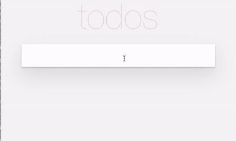

# turbo-flask

Integration of Hotwire's Turbo library with Flask, to allow you to create
applications that look and feel like single-page apps without using
JavaScript.



## How to Install

```bash
pip install turbo-flask
```

## How to Add to your Project

Direct initialization:

```python
from flask import Flask
from turbo_flask import Turbo

app = Flask(__name__)
turbo = Turbo(app)
```

Factory function initialization:

```python
from flask import Flask
from turbo_flask import Turbo

turbo = Turbo()

def create_app():
    app = Flask(__name__)
    turbo.init_app(app)

    return app
```

To add Turbo-Flask to your pages, include `{{ turbo() }}` in the `<head>`
element of your main Jinja template:

```html
<!doctype html>
<html>
  <head>
    {{ turbo() }}
  </head>
  <body>
    ...
  </body>
</html>
```

## Configuration

There is only one configuration variables supported by this extension:

- `TURBO_WEBSOCKET_ROUTE`: The route URL on which the client can connect using
WebSocket to receive Turbo Stream updates. By default, the `/turbo-stream`
URL is used. If this variable is set to `None`, WebSocket support is disabled.

## How to Use

The Turbo Drive and Turbo Frames features provided by turbo.js do not require
server side support, so access to these features is enabled just by adding the
library as indicated above. Consult the
[turbo.js documentation](https://turbo.hotwire.dev/) to learn how to take
advantage of these features.

However, if you decide to use the Turbo Streams feature of turbo.js, this
extension has helpers to generate correctly formatted streams.

The `turbo` object has five helper methods that generate the different types
of stream components:

- `turbo.append(content, target)`: add `content` at the end of `target`
- `turbo.prepend(content, target)`: add `content` at the start of `target`
- `turbo.replace(content, target)`: replace `target` with `content`
- `turbo.update(content, target)`: replace the contents of `target` with `content`
- `turbo.remove(target)`: remove `target`

In all these methods, `content` is a string with HTML content, usually the
result of invoking Flask's `render_template()` function. The `target` argument
is the id of the element in the page that will be modified.

There are two supported use cases for the Turbo Streams feature: a response to
a POST request, and a server-push update over WebSocket. The following sections
describe how to deliver streams for both.

### Responding to a POST Request with a Turbo Stream

The following example shows how to deliver a Turbo Stream as a response to a
POST request:

```python
    if turbo.can_stream():
        return turbo.stream(
            turbo.append(render_template('_todo.html', todo=todo), target='todos'),
        )
    else:
        return render_template('index.html', todos=todos)
```

Here is another example using a list of updates:

```python
    if turbo.can_stream():
        return turbo.stream([
            turbo.append(render_template('_todo.html', todo=todo), target='todos'),
            turbo.update(render_template('_todo_input.html'), target='form')
        ])
    else:
        return render_template('index.html', todos=todos)
```

The `turbo.stream()` method takes one or a list of Turbo Stream updates and
generates a Turbo Stream response that can be returned directly from the Flask
view function.

The `turbo.can_stream()` method is a helper methods that returns `True` if the
client indicated that it supports Turbo Stream responses. It is a good idea to
fall back to a standard Flask response when Turbo Streams aren't accepted by
the client, as shown in the above examples.

### Pushing Updates via WebSocket Streaming

The application can, at any time, push updates to parts of the page using the
`turbo.push()` helper method. Below you can see a simple example:

```python
def update_load():
    with app.app_context():
        while True:
            time.sleep(5)
            turbo.push(turbo.replace(render_template('loadavg.html'), 'load'))
```

In the above example the `turbo.push()` method will send the update to all
connected clients.

The `turbo.push()` method supports an optional `to` argument that can be used
to select one or more specific clients to receive the update. To take
advantage of this, the application first needs to provide a function that
assigns an id to each connected client, and decorate it with the
`turbo.user_id` decorator. In the following example, the id for each client is
obtained from Flask-Login's `current_user`:

```python
@turbo.user_id
def get_user_id():
    return current_user.id
```

To push an update to a given client, the `to` argument can be added to the
`turbo.push()` method:

```python
turbo.push(turbo.replace(render_template('loadavg.html'), 'load'),
           to=admin_user_id)
```

It is also possible to send the update to multiple clients by passing a list
in the `to` argument:

```python
turbo.push(turbo.replace(render_template('loadavg.html'), 'load'),
           to=[admin_user_id, moderator_user_id])
```

## Deployment

The WebSocket support in this extension is provided by the
[Flask-Sock](https://github.com/miguelgrinberg/flask-sock) package, which
supports WebSocket servers based on Gunicorn, Eventlet, Gevent and the Flask
development web server. Refer to its documentation for deployment details.
